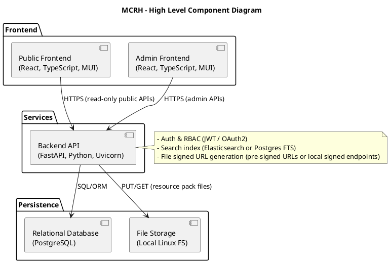

# MCRH — Business Requirements Document

Version: 1.0
Author: Project Owner
Last Updated: 2025-10-10

## 1. Project Vision

MCRH is a centralized web-based repository management system for Minecraft resource packs (also called texture packs). The application enables authorized users to upload, organize, search, and download resource packs while exposing rich compatibility metadata for Minecraft versions, individual mods, and modpack collections. The product goal is to reduce time spent finding compatible resource packs and avoid version conflicts.

## 2. Key Objectives

- OBJ-01: Centralize storage and management of Minecraft resource packs.
- OBJ-02: Provide multi-dimensional filtering (Minecraft versions, mods, modpacks).
- OBJ-03: Track compatibility metadata for each resource pack.
- OBJ-04: Enable quick discovery and direct download of appropriate packs.
- OBJ-05: Support administrative upload and organization workflows.

## 3. Business Requirements

### A. Resource Pack Management
- A01: Upload System — The system shall allow admin users to upload resource pack files (ZIP format) and attach metadata during upload (name, description, author, tags, compatible versions, mods, modpacks).
- A02: Batch Uploads — The system shall support batch uploads where multiple packs are uploaded together and metadata is captured per pack.
- A03: Edit Metadata — The system shall allow admin users to edit resource pack metadata after upload, including tags, preview images, and description.
- A04: Archive/Delete — The system shall allow admin users to archive or delete obsolete packs.
- A05: Storage Organization — The system shall support organizing packs into collections or categories and detect duplicate uploads (same content, different versions).

### B. Compatibility Tracking
- B01: Minecraft Version Association — The system shall allow associating each resource pack with one or more Minecraft versions (e.g., 1.19.2, 1.20.1) and optionally specify version ranges.
- B02: Mod Tagging — The system shall allow tagging packs with supported mods and specific mod versions.
- B03: Modpack Association — The system shall allow associating packs with known modpack collections (name + version) and support multiple associations per pack.

### C. Search & Filtering
- C01: Multi-Criteria Filtering — The system shall allow users to filter packs by Minecraft version, mod name/version, modpack name/version, pack name, and tags, simultaneously.
- C02: Text Search — The system shall provide text search across pack names, descriptions, and tags with basic relevance sorting.
- C03: Browse Views — The system shall provide grid and list browse views, with quick preview cards showing key metadata (versions, mods, downloads).

### D. Download & Access
- D01: Direct Downloads — The system shall provide secure, direct download links for resource pack files.
- D02: Pack Details — The system shall provide a detail page for each pack showing all metadata, compatibility info, preview images, and download button.

### E. User Interface & UX
- E01: Responsive UI — The user interface shall be responsive and usable on desktop and mobile devices.
- E02: Admin Interface — The system shall provide an admin panel for uploads, bulk edits, and management dashboards.

### F. Technical & Security Requirements
- F01: File Storage Integration — The system shall store resource packs in cloud storage (S3-compatible or similar) and provide secure download URLs.
- F02: Search Performance & Scalability — The system shall support efficient search/filtering and scale to thousands of packs with caching strategies in place.
- F03: Security & Access Control — The system shall provide authentication for admin functions and read-only public access for browsing/downloading. Admin actions require role-based access control.

## 4. Architecture Diagram



## 5. Tech Stack

- Frontend (Public & Admin): TypeScript + React with Material UI (MUI)
	- Recommended: Vite for build, React Router for navigation, React Query for data fetching.
	- Serve as static assets behind a CDN or nginx.

- Backend API: FastAPI (Python) running on Uvicorn/Gunicorn
	- Use Pydantic models for request/response validation.
	- Expose REST endpoints for public and admin operations; separate routes or RBAC middleware for admin.

- Database: PostgreSQL
	- Use SQLAlchemy + Alembic for migrations and ORM; store metadata, tags, associations, and audit logs.

- File Storage: Local Linux filesystem (e.g., /var/mcrh/storage)
	- Backend writes and reads files from mounted path; generate signed download endpoints or serve behind nginx.
	- In production consider switching to S3-compatible object storage for scalability.

## Deployment / Dev notes

- Development: a docker-compose with services (frontend dev server, backend, postgres, local file volume) will make onboarding simple.
- Production: containerize backend and frontends; run behind nginx (TLS), use managed Postgres or a hardened PostgreSQL instance, and mount a dedicated persistent volume for file storage. Add regular backups and monitoring for the DB and filesystem.

---

## 6. Code Architecture & Standards

This project follows strict architectural and coding principles to ensure maintainability, scalability, and clarity.

### Core Architectural Principles

- **Hexagonal Architecture (Ports & Adapters)**: Clear separation between domain logic, application orchestration, and infrastructure
  - Structure: `Driver Adapters → Inbound Ports → Use Cases → Outbound Ports → Driven Adapters`
- **SOLID Principles**: Single Responsibility, Open/Closed, Liskov Substitution, Interface Segregation, Dependency Inversion
- **Clean Boundaries**: Domain logic never depends on infrastructure; infrastructure depends on domain abstractions
- **Separation of Concerns**: One responsibility per file, one file per concept
- **Cloud-Native**: Stateless, environment-variable driven, no in-memory cross-request dependencies
- **Self-Documenting**: Code structure and naming should be clear enough that the project tree itself explains the system

### Backend Structure

```
example-service/
├── app/
│   ├── modules/                    # Business domains (bounded contexts)
│   │   └── example-module/
│   │       ├── di.py               # Dependency injection
│   │       ├── domain/             # Pure business logic (no framework dependencies)
│   │       │   ├── entities/       # Domain entities
│   │       │   └── exceptions/     # Domain-specific exceptions
│   │       ├── application/        # Use cases & ports
│   │       │   ├── ports/
│   │       │   │   ├── inbound/    # Use case interfaces (primary ports)
│   │       │   │   └── outbound/   # Repository/service interfaces (secondary ports)
│   │       │   └── use_cases/      # Business logic orchestration
│   │       └── adapters/           # External implementations
│   │           ├── inbound/        # Driving adapters (HTTP/API)
│   │           │   └── http/
│   │           │       ├── routes/
│   │           │       ├── dtos/   # Request/Response models
│   │           │       ├── mappers/# DTO ↔ Domain transformations
│   │           │       └── exceptions/
│   │           └── outbound/       # Driven adapters (infrastructure)
│   │               ├── database/
│   │               └── external/
│   ├── infrastructure/             # Shared infrastructure (security, logging, events)
│   ├── api/                        # API composition layer
│   └── main.py                     # Application entry point
```

### Frontend Structure

```
src/
├── api/                    # API Layer - Anti-corruption layer for backend
│   ├── clients/            # Domain-specific API clients
│   ├── models/             # API DTO type definitions
│   └── mappers/            # DTO → Domain model transformations
├── core/                   # Business Logic Layer
│   └── domain/             # Specific domain (e.g., resourcePacks)
│       ├── models/         # Domain entities (pure TypeScript)
│       ├── hooks/          # React hooks for domain operations
│       └── services/       # Business logic services
├── components/             # Shared UI Components (pure presentational)
├── pages/                  # Page Components (one per route)
├── layouts/                # Layout structures
├── routes/                 # Routing configuration
├── utils/                  # Shared utility functions (pure, no side effects)
├── context/                # Global state management
├── theme/                  # UI theme configuration
└── main.tsx                # Application entry point
```

### Key Rules

1. **One Responsibility Per File**: Each file contains exactly one class, interface, component, or function
2. **No Adapter Dependencies**: Adapters never depend on each other; use cases never depend on adapters
3. **Type Safety**: All code must be strictly typed (TypeScript/Python type hints)
4. **DTOs, Entities, Mappers**: Separate concerns - never mix data transfer with domain logic
5. **UI vs Logic Separation**: UI components are pure presentational; business logic lives in `core/` or `services/`
6. **Self-Documenting Code**: Descriptive names, comprehensive JSDoc/docstrings, clear project tree structure
7. **No Value Objects** (unless absolutely necessary): Prefer simple types and interfaces
8. **Indentation**: 4 spaces consistently
9. **Error Handling**: Dedicated `/errors` or `/exceptions` directories with structured error types

### Documentation Standards

- Every exported function, class, component must have JSDoc/docstring with:
  - Brief description of purpose
  - `@param` for each parameter with type and description
  - `@returns` with return type and description
  - Example usage where complexity warrants it

### Architecture Verification

The project structure should be self-explanatory to anyone familiar with Hexagonal Architecture:
- Directory hierarchy serves as living documentation
- No hidden coupling between layers
- Clear data flow: External → Adapters → Application → Domain → Application → Adapters → External
- New contributors should understand the system by analyzing the project tree alone


